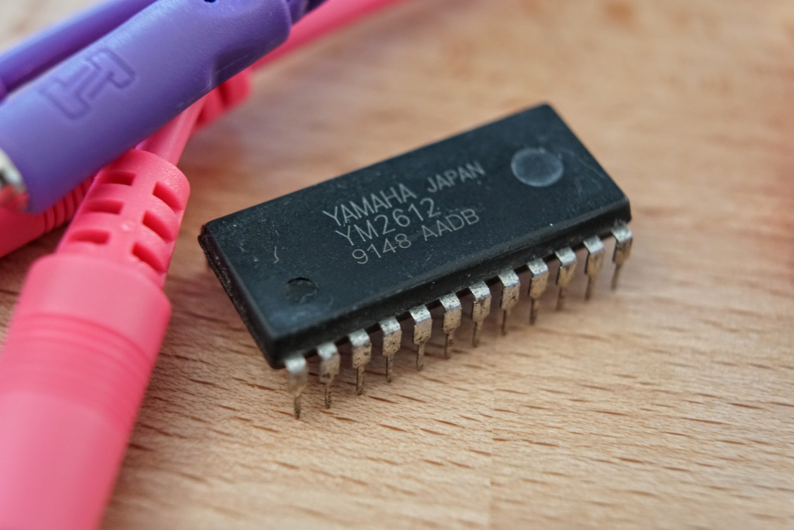

# The YM2612 Reference Project

Welcome to the YM2612 Reference Project, an open-source, community-sourced reference for Yamaha's YM2612 and YM3438 sound chips.

Our goal is to eventually provide up-to-date, accurate, and complete documentation for these chips. It's still pretty early days, so if you're interested in helping please reach out on [GitHub](https://github.com/theacodes/ym2612dev) and we'll be happy to have you join us!

## How to read this documentation

This documentation covers the YM2612 from an *isolated* prospective, as if it were the datasheet for the chip itself. Because of this there is likely going to be information here that isn't relevant to your use case. For example, if you're writing Mega Drive/Genesis games you won't find the electrical and timing information all that useful. However, it is our mission to be as comprehensive as cover as many use cases as possible. If you find this documentation lacking for your use case please [file a bug on GitHub](https://github.com/theacodes/ym2612dev/issues).

## Historical background

TODO: Describe the lineage of the YM2612, the OPN family, and the successors.

## Hardware that uses the YM2612

TODO: List all known hardware that uses the YM2612

## Overview

TODO: Describe the basic operating principles of the YM2612: How it produces sounds, how many voices, how many operators, additional features, etc. Linking down into deeper sections as needed.

## Sourcing the YM2612

TODO: List common sources for YM2612 chips, including eBay and salvage. Describe ways to test the YM2612

## Electrical specifications

TODO: Show a pinout and pin description of the YM2612, including absolute minimum and maximum ratings.

## Timing specifications

TODO: Show timing diagrams and timing guidelines for reads and writes.

## Register overview

TODO: Include an overall map of the register address space with links to other sections for more details.

## FM Algorithms

TODO: Include illustrations and descriptions of each of the seven algorithms.

## Operator 1 feedback

## The low-frequency oscillator

## The timers

## Channel frequency/note

# TODO: Describe frequency & banks calculation.

## Channel/note on/off

## Operator parameters

### Frequency

DT1, MUL

### Envelope

TL, AR, D1R, D2R, D1L, RR

### Rate scaling and modulation

RS, AM

## SSG Envelopes

## Channel 3 & 6 special mode

## Additional resources

TODO